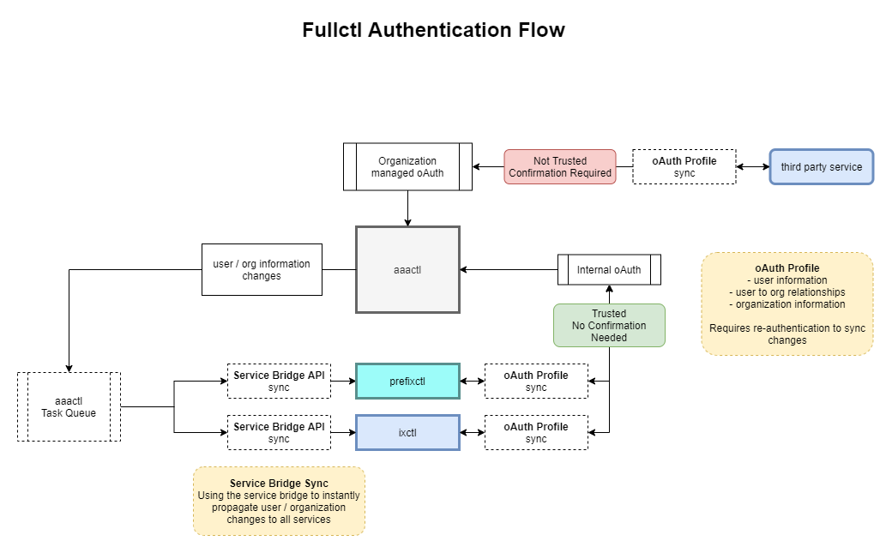

# aaactl

Authentication for fullctl based services and applications should be facilitated through [aaactl](https://github.com/fullctl/aaactl).

aaactl is an authentication and account management hub that can also handle service billing to the users. 

